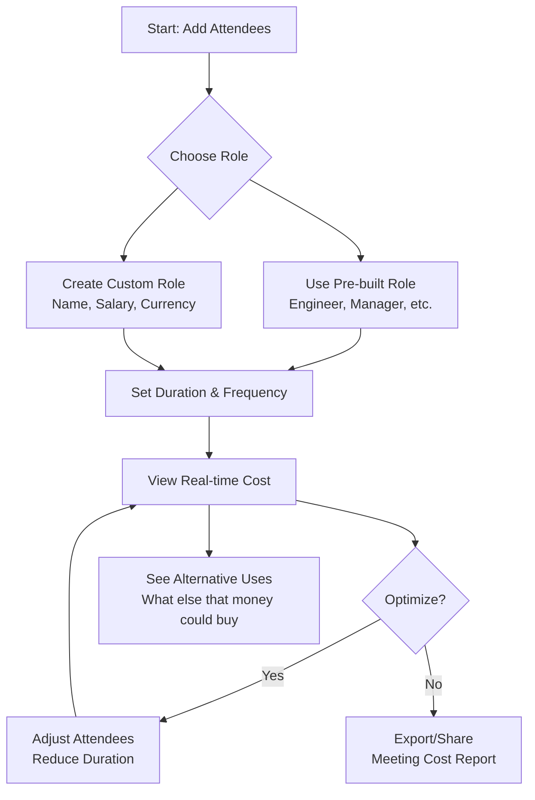

# Meeting Cost Calculator 💼💰

[](https://github.com/Aliriyaj007/Meeting-Cost-Calculator/stargazers)
[](https://github.com/Aliriyaj007/Meeting-Cost-Calculator/network)
[](LICENSE)
[](https://github.com/Aliriyaj007/Meeting-Cost-Calculator)
[](https://github.com/Aliriyaj007/Meeting-Cost-Calculator)

> **Transform abstract meeting time into tangible financial awareness. No signup, no database, no nonsense.**

## 🎯 The Problem It Solves

**Meetings are invisible money pits.** Organizations waste billions annually on unproductive meetings without realizing the actual cost.

| Before This Tool | After This Tool |
|-----------------|-----------------|
| ❌ Meetings scheduled without cost consideration | ✅ Real-time cost displayed before scheduling |
| ❌ No awareness of financial impact | ✅ Clear visualization of what else that money could buy |
| ❌ Same attendees for every meeting | ✅ Optimized attendee lists based on role costs |
| ❌ 60-minute meetings by default | ✅ Duration optimized for cost efficiency |
| ❌ No metric for meeting ROI | ✅ Cost-per-decision awareness |

## 🚀 Try It Instantly

**Web App:** [aliriyaj007.github.io/Meeting-Cost-Calculator](https://aliriyaj007.github.io/Meeting-Cost-Calculator)

**Direct Download:** [meeting-cost-calculator.html](https://raw.githubusercontent.com/Aliriyaj007/Meeting-Cost-Calculator/main/index.html) (Right-click → Save As)

## ✨ Key Features

### 🎨 **7 Premium Themes**
Choose from professionally designed color schemes:
1. **Google Clean** (Default light theme)
2. **Dark OLED** (Pure black for OLED screens)
3. **Midnight Blue** (Professional dark blue)
4. **Emerald Green** (Green-focused theme)
5. **Sunset Gradient** (Gradient background theme)
6. **Minimal Gray** (Clean monochrome)
7. **Purple Accent** (Purple-focused theme)

### 📊 **Core Functionality**
- **Real-time Cost Calculation**: Watch costs update as you add attendees
- **Attendee Builder**: Pre-loaded roles + custom role creation
- **Duration Optimization**: Slider + quick presets (30min, 45min, 1hr, etc.)
- **Frequency Analysis**: One-time, weekly, bi-weekly, monthly meetings
- **Alternative Uses Visualization**: See what else that money could buy (laptops, training, etc.)

### ⚙️ **Advanced Features**
- **Full Customization**: Decimal precision, work days/year, hours/day
- **Data Persistence**: All data saved locally in your browser
- **Import/Export**: Backup and restore your configuration via JSON
- **Keyboard Shortcuts**: Ctrl+S to save, Escape to close modals
- **Responsive Design**: Perfect on mobile, tablet, and desktop

## 📈 How It Works



## 🛠️ Installation & Usage

### **Method 1: Web App (Recommended)**
Simply visit: **[aliriyaj007.github.io/Meeting-Cost-Calculator](https://aliriyaj007.github.io/Meeting-Cost-Calculator)**

### **Method 2: Local Single File**
```bash
# Download the file
curl -O https://raw.githubusercontent.com/Aliriyaj007/Meeting-Cost-Calculator/main/index.html

# Or use wget
wget https://raw.githubusercontent.com/Aliriyaj007/Meeting-Cost-Calculator/main/index.html

# Open in browser
open index.html  # macOS
xdg-open index.html  # Linux
start index.html  # Windows
```

### **Method 3: Clone Repository**
```bash
git clone https://github.com/Aliriyaj007/Meeting-Cost-Calculator.git
cd Meeting-Cost-Calculator
open index.html
```

## 🎮 Quick Start Guide

1. **Add Attendees**
   - Select from pre-loaded roles (Engineer, Manager, Director)
   - Or create custom roles with specific salaries

2. **Set Meeting Parameters**
   - Adjust duration with slider or quick buttons
   - Select frequency (one-time, weekly, monthly)

3. **Analyze Costs**
   - View real-time total cost
   - See cost per minute
   - Check annual projections

4. **Optimize**
   - Remove unnecessary attendees
   - Reduce duration
   - See alternative uses for that budget

## 🏗️ Technical Architecture

```
meeting-cost-calculator/
├── Single HTML file containing:
│   ├── HTML5 Semantic Structure
│   ├── CSS3 with Custom Properties (Theming)
│   └── Vanilla JavaScript (ES6 Modules Pattern)
│
├── No Dependencies
│   ├── No frameworks
│   ├── No build tools
│   ├── No package managers
│   └── No external CDNs (except Google Fonts)
│
├── Client-side Only
│   ├── LocalStorage for persistence
│   ├── File API for import/export
│   └── Canvas API for calculations
│
└── PWA Ready
    ├── Offline capable
    ├── Installable
    └── Responsive design
```

## 🔧 Customization Examples

### **Change Calculation Parameters**
```javascript
// These settings are adjustable in the UI:
{
  workDays: 260,        // Working days per year
  hoursPerDay: 8,       // Working hours per day
  currency: "USD",      // Base currency
  decimals: 2           // Decimal precision
}
```

### **Add Custom Roles via JSON Import**
```json
{
  "customRoles": [
    {
      "id": "custom_cto",
      "name": "Chief Technology Officer",
      "salary": 300000,
      "currency": "USD"
    }
  ]
}
```

## 📱 Browser Support

| Browser | Version | Support |
|---------|---------|---------|
| Chrome | 60+ | ✅ Full |
| Firefox | 55+ | ✅ Full |
| Safari | 12+ | ✅ Full |
| Edge | 79+ | ✅ Full |
| Opera | 50+ | ✅ Full |
| Mobile Browsers | Latest | ✅ Full |

## 🤝 Contributing

Contributions are welcome. This project proves its value by existing, and improvements make it more valuable.

**Development workflow:**
1. Fork the repository
2. Create a feature branch (`git checkout -b feature/improvement`)
3. Test your changes (open `index.html` in browser)
4. Commit (`git commit -am 'Add some improvement'`)
5. Push (`git push origin feature/improvement`)
6. Create a Pull Request

**Areas for contribution:**
- Additional themes
- More pre-loaded roles by region
- Enhanced visualization options
- Additional export formats
- Browser extension wrapper

## 📄 License

MIT License - see [LICENSE](LICENSE) file for details.

## 👤 Author & Contact

**Riyajul Ali**  
*Senior Product Architect & Open Source Maintainer*

- GitHub: [@Aliriyaj007](https://github.com/Aliriyaj007)
- Email: [aliriyaj007@protonmail.com](mailto:aliriyaj007@protonmail.com)
- LinkedIn: [linkedin.com/in/Aliriyaj007](https://linkedin.com/in/Aliriyaj007)

## 🏆 Why This Exists

This tool exists because:
1. **Meetings are expensive** but costs are invisible
2. **Awareness drives change** - seeing is believing
3. **Simplicity wins** - no login, no setup, just utility
4. **Data should be private** - everything stays in your browser
5. **Tools should be accessible** - works offline, single file, no dependencies

> "What gets measured gets managed." - Peter Drucker

---
**Star this project if it saves your organization time and money.**  
**Fork it if you can make it better.**  
**Use it because meetings shouldn't be financial black holes.**

*Last updated: March 2024*
